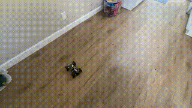
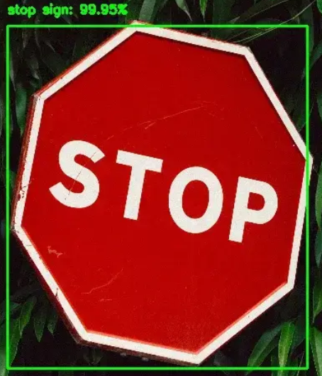
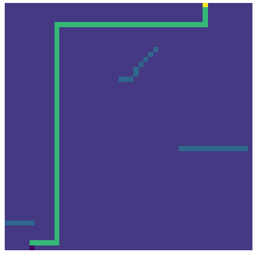

# Autonomous Raspberry Pi Car
  

## Overview
This is an autonomous car project completed as part of an IoT course. The purpose of this project was to create a system that allows a vehicle with an ultrasonic sensor, camera, and target location to navigate to that location autonomously, while avoiding obstacles and reacting to road markers, in this case, people and stop signs.

## Functionality
The functions of this vehicle can broadly be broken into the following categories: mapping environment and object detection (ultrasonic sensor), object recognition (camera), route planning (A* algorithm), and movement + localization. Generally speaking the program works in the following manner:
1. User provides a destination to the vehicle in relative terms to the vehicle. EX: (500cm forward, 80cm to the right)
2. Vehicle pulses ultrasonic sensor while moving it to the left and right, using the values returned from the sensor to build a map of obstacles and free space around the vehicle.
3. Vehicle utilizes the map built in step 2 to plan a route to its destination, utilizing a modified A* algorithm designed to keep it away from obstacles.
4. Vehicle attempts to drive a pre-defined number of steps along the route it has planned.
5. Vehicle utilizes TensorFlow and its camera to attempt to react to civilians and stop signs it views while moving.
6. Vehicle has moved the pre-defined number of steps, if it has not reached its destination, return to step 2. 

### Mapping and Object Detection (Ultrasonic)
  
*The vehicle utilizing its ultrasonic sensor to avoid collisions while driving at random around the room (similar to a Roomba).*

An ultrasonic sensor mounted to the front of the car uses sound waves to interpret how far away objects are from the vehicle.

Utilizing this functionality, along with the ability to rotate the sensor, the vehicle is able to tell how far away obstacles are at various angles in front of it — allowing it to interpolate from measurements taken to build a virtual map of the obstacles in its environment.

  
*An example virtual map showing the vehicles environment in 2D. Dark purple = vehicle. Blue = obstacle. Yellow = objective to drive to.*

### Object Recognition (Camera)
  
In addition to the ultrasonic sensor on the front of the vehicle, there is also a camera. Utilizing the camera and a pre-trained TensorFlow object detection model, the vehicle is able to inspect a video feed coming from its camera for obstacles in its way, specifically, stop signs and people. Using programmed rules, the vehicle stops temporarily at stop signs, and indefinitely until civilians move from its path. Due to the raspberry pi having limited compute, object recognition runs at ~2 FPS, meaning the vehicle usually ends up reacting about a half second after seeing an object of interest, which is slower than one  would want for a real vehicle!

### Route Planning (A*)
  
*An example route from the vehicles current destination to the target, avoiding obstacles in the environment. Dark purple = vehicle. Blue = obstacle. Yellow = objective to drive to. Light green = route to objective.*

Utilizing the vehicles internal map of the environment, a modified version of the A* pathfinding algorithm is run to build a route from the vehicles current location to the target destination. This algorithm attempts to keep the vehicle away from obstacles when possible to keep the chance of collisions low.

### Movement and Localization
  
*Example of the car building a virtual map of the environment and navigating towards its destination. Note that inaccurate readings are at times returned by the ultrasonic sensor.*

The vehicle has an electric motor in each wheel, but no sensors for speed, acceleration, direction, etc. Due to this, the car relies on hand-calculated motor movements for turning angles and distances traveled, while assuming each of its movements end at their expected ending location. **This is not accurate! This also means the vehicle has very little sense of where it exists in the world outside of its assumptions. Although this is obviously not ideal, it works well enough for the time/project constraints given.**

After building a map, and driving along the proposed route, the vehicle will eventually stop, check again for obstacles, update its internal representation of the environment, and then continue moving. This is done to get more accurate readings from the ultrasonic sensor as the vehicle approaches obstacles.

If given more time I would have added additional sensors or perhaps attempted using environmental keypoints to improve the vehicles knowledge of its movements and position in the world.

## Setup
In order to use the code in this project, a working Freenove 4WD vehicle will be necessary.
Additionally, you will need opencv built for the raspberry pi with gstreamer (this can be a pain). A variety of additional python dependencies are necessary as well. I don't anticipate anyone actually building this, but on the off chance you do and have issues, please reach out!
- https://github.com/Freenove/Freenove_4WD_Smart_Car_Kit_for_Raspberry_Pi
- https://learnopencv.com/build-and-install-opencv-4-for-raspberry-pi/
- In the home directory: `pip3 install -r requirements.txt`
- Run main.py from the same directory as the Freenove libraries are installed (Motor, Servo, Ultrasonic, etc...)